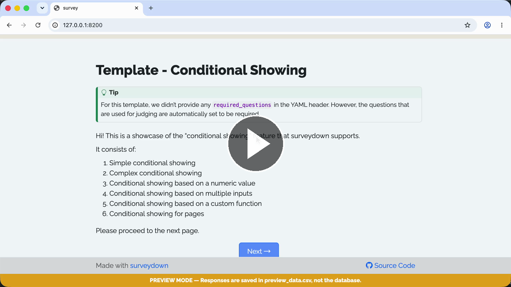

# Template - Conditional Showing

A template of conditional showing (show a question or a page if a condition is true).

### See it in action

Watch the **Walkthrough recording:**

[](https://cdn.jsdelivr.net/gh/surveydown-dev/template_conditional_showing@main/video-recording.mp4)

### Create this template

Run this command in your R console:

```r
surveydown::sd_create_survey(
  #path = "path/to/survey",
  template = "conditional_showing"
)
```

### Learn more

- [Template page - Conditional Showing](https://surveydown.org/templates/conditional_showing)
- [Document page - Conditional logic: conditional showing](https://surveydown.org/docs/conditional-logic#conditional-showing)
- [Document page - Start with a template](https://surveydown.org/docs/getting-started#start-with-a-template)
